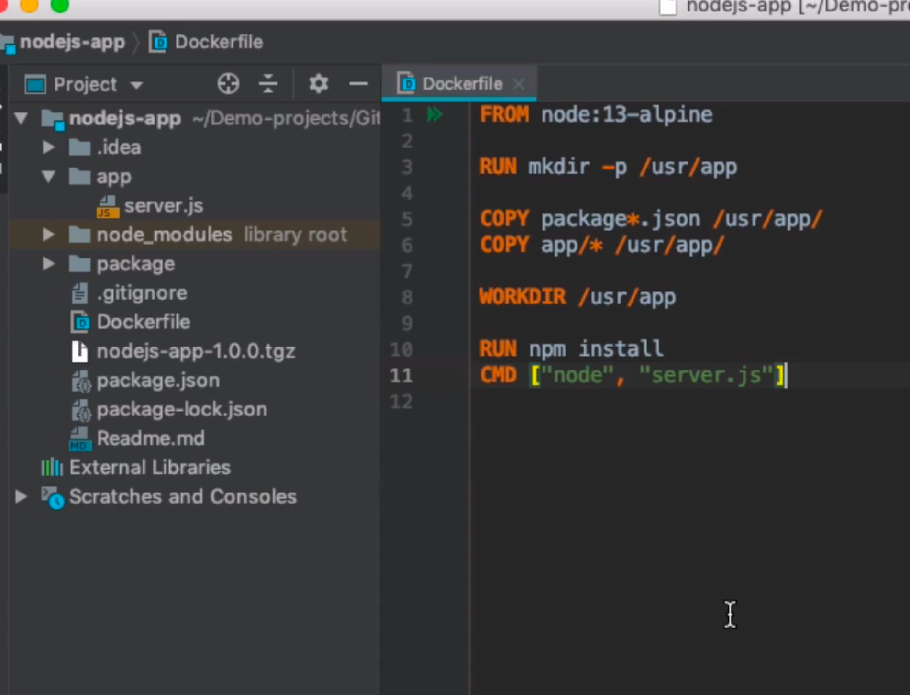
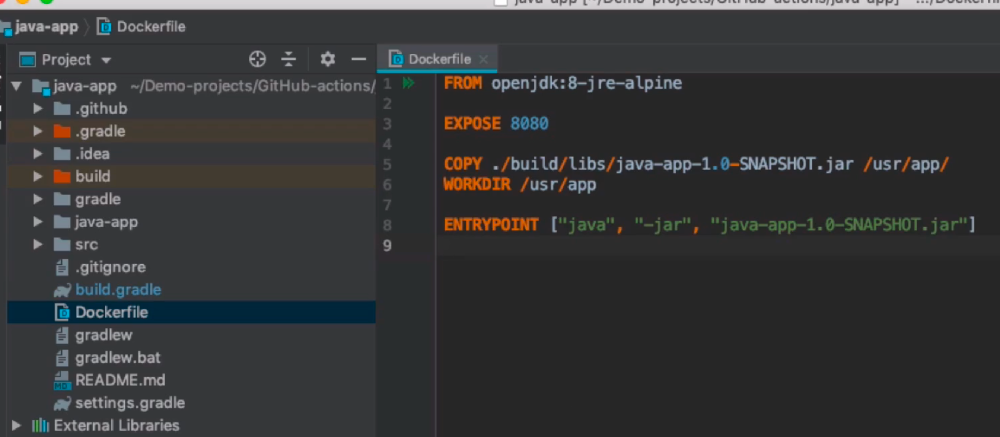
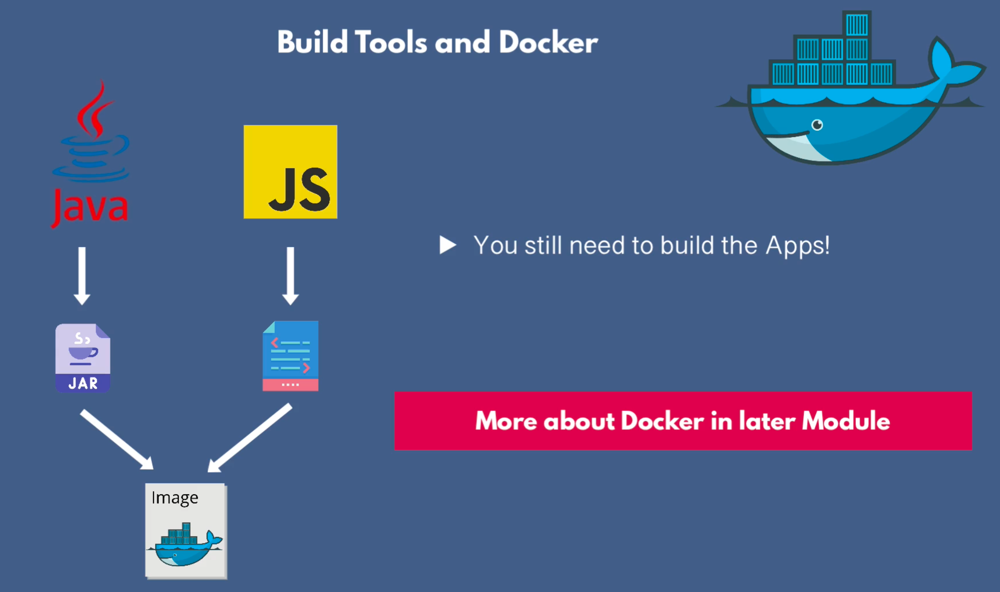

## Build Tools & Package Managers
- For managing app dependencies…downloads the dependencies for the app from its repository before it builds
- For building, packaging, and publishing artifacts
- Examples
    1. Gradle/Maven for Java….package managers and build tools
    2. NPM/Yarn for JS… package managers and not build tools
- Dependency file
    - Package.json === Pom.xml === build.gradle
- Packaging = building(compiling, compressing) the code into 1 single self-contained file called an Artifact
    - Then the artifact needs to be kept in storage somewhere called Artifactory Repository - examples Nexus, JFrog
    - Stored so that it can be deployed multiple times in diff envs
- What kind of file extension is in the artifact?
    - depends on the language used
        - java ⇒ JAR, Java ARchive
        - Js doesn’t have a special type file so ⇒ zip or tar file
- For Js,
    - NPM can package the app w/ the package.json dependencies
        - and when it gets to the server, depen are installed first before app run
    - For Frontend apps,
        - the code needs to be TRANSPILED - for browser compatibility, sort of backward compatibility of modern js syntax into standard/old for browsers to understand
        - then, frontend code needs to be compressed/minified/bundle to reduce files size for browsers to load them faster
        - tools to use: Webpack, Grunt
        - Example of compressed backend node app using webpack
            
            
- Patterns across all build tools
    

## Build Tools and Docker
- W/ Docker, no need to build and move different artifact types - Jar, dll, zip
    - just one artifact type - ie Docker Image
- No need for several repositories (NPM, Nuget, Maven) for each artifact type
    - just one for the Docker image - ie Docker Hub
- No need to install dependencies on prod server
    - install all depends inside the Docker Image
        - using Dockerfile, all app dependencies are copied into the image file system, then installed with “npm install” inside the docker image that will be generated
            
            
            
        - using Dockerfile, the already built app (for static langs like java, c#) is copied inside the Docker image file system…so not dependecy installaiton is required here
            
            
            
- In short,
    - Docker makes it easier to consolidate everything
        
        
        
    - Build Docker Image ⇒ Push to Repo ⇒ Pull and Run on Server
    - As DevOps Engr, **you don’t run the application locally** like the dev, so you need to configure a build automation tool, called CI/CD Pipeline to get the final artifact on dev/prod server
        - Build automation steps include:
            1. install dependencies
            2. run tests
            3. build(for java)/bundle(webpack for js) app
            4. push to repo