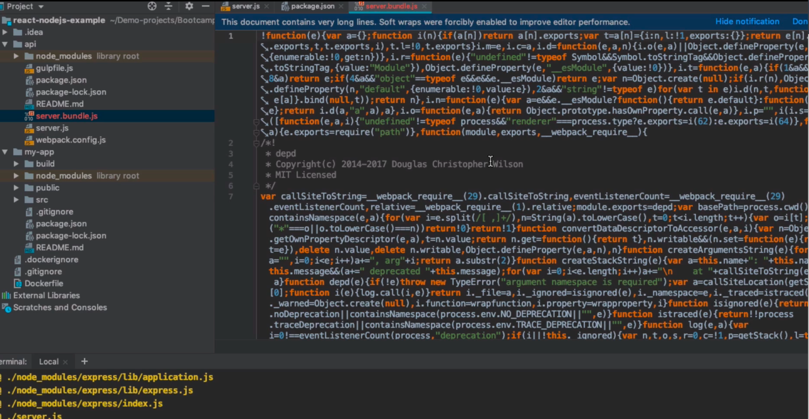
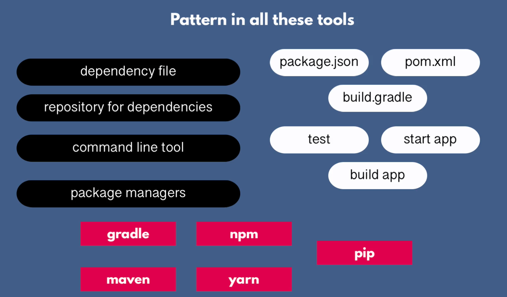

## Build Tools & Package Managers
- For managing app dependencies…downloads the dependencies for the app from its repository before it builds
- For building, packaging, and publishing artifacts
- Examples
    1. Gradle/Maven for Java….package managers and build tools
    2. NPM/Yarn for JS… package managers and not build tools
- Dependency file
    - Package.json === Pom.xml === build.gradle
- Packaging = building(compiling, compressing) the code into 1 single self-contained file called an Artifact
    - Then the artifact needs to be kept in storage somewhere called Artifactory Repository - examples Nexus, JFrog
    - Stored so that it can be deployed multiple times in diff envs
- What kind of file extension is in the artifact?
    - depends on the language used
        - java ⇒ JAR, Java ARchive
        - Js doesn’t have a special type file so ⇒ zip or tar file
- For Js,
    - NPM can package the app w/ the package.json dependencies
        - and when it gets to the server, depen are installed first before app run
    - For Frontend apps,
        - the code needs to be TRANSPILED - for browser compatibility, sort of backward compatibility of modern js syntax into standard/old for browsers to understand
        - then, frontend code needs to be compressed/minified/bundle to reduce files size for browsers to load them faster
        - tools to use: Webpack, Grunt
        - Example of compressed backend node app using webpack
            
            
- Patterns across all build tools
    