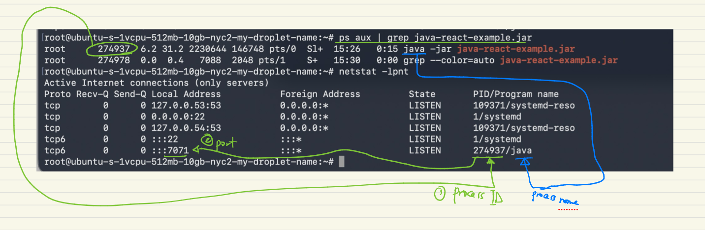
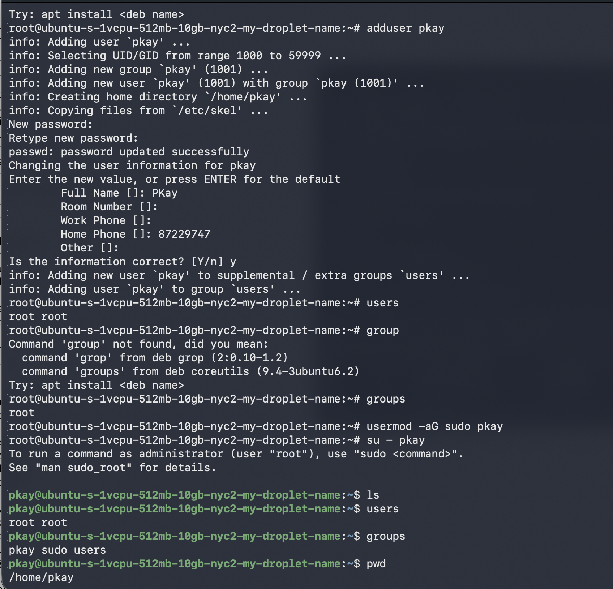

## Cloud and IaaS
- You/Company can buy your own physical servers, set them up, connect to a network, and deploy your apps on them
    - You can install Jenkins on it and manage your own server and  infrastructure or sometimes managed by a dedicated team
    - so if something breaks in the server, like hard drive fails, power suply dies, or somthing breaks in the network, you fix it yourself
- Instead, you can DELEGATE all these infrastructure management to another company to handle the physical infrastructure for you
    - Meaning, moving the physical infrastructure to the cloud which is another firms physical infrastructure
    - then you just rent the servers as Virtual Machines and SSH  into them
- IaaS ⇒ using Infra managed by someone else
    - ⇒ from OnPrem Servers to Cloud
    - Service Providers include: AWS, GCP, Microsoft Azure, Digital Ocean
- SSH Key
    - That is how you connect to VMs
    - Configure it on your machine and share your pub key with the platform,
        - That pub key is configured in the entire SP platform and allows your local machine to be authenticated and connect to the VM without needing username and password login everytime
- Firewalls and VMs and SCP
    - By default, VMs are closed for only internal communications
    - So, to allow external inbound communications into the server,
        - you need to setup a FIREWALL to open SSH  Port 22, configure my local pc ip to the inbound connection whitelist, to allow my  local pc to ssh into the VM
            - check current local ip `$ curl -4 ifconfig.me`
        - If your application api like Spring Boot, runs on port 5999, configure an inbound Custom-type TCP protocol to allow port 5999 in perhaps all ip inbound address(then tighten it later)
    - Login via ssh:
        - `$ ssh root@<the-vm-ip>`
    - SCP
        - secure copy (scp) build artifact from local pc to VM root home dir
        - `$ scp path/to/file root@ root@<the-vm-ip>**:/root**`
    - Checking for processes running
        - `$ ps aux | grep "search term like java"`
    - Checking what port a process is listening to
        - you will see the port that you opened for th inbound request to the Springboot application
        - `$ netstat -lpnt`...shows all process w/ active connections
            
- Permmissions for Running applications into process
    - Don’t work with the root user or use the root user to start applications
    - Best practice is to:
        - create a separate user for each application, in order to give the user only the necessary perms to run the application
    - To create new user ⇒ `$ adduser <pkay>`
        - `pkay` user doesn’t have root access and can’t do what the root user can do (execute commands just like root user) unless given same level of perms,
        - by adding `pkay` user to the `sudo` group ⇒ `$ usermod -aG sudo <pkay>`
        - switch to the new user ⇒ `$ su - <pkay>`
        - `#` indicates ⇒ Root User
        - `$` indicates ⇒ Standard Linux User
        
    - ssh pub key config at the IaaS UI is for root user by default

        - was able to ssh into remove because local PC's pub ssh key is shared/copied to Iaas Digital Ocean UI (ie root user in remote server)...so need to share the pub key w/ the {pkay} user as well in the remote server...so how do i copy and share w/ {pkay} user as well using the command line, not the ui
        
        !image.png
        
        - So now if a new user is created is used to ssh into the machine `pk@<the-vm-ip>`,  it can’t log in using SSH because the new user does not recognise the pub_key configuration done for the default root user using the UI for authentication…so ssh config needs to be done for `pk` user as well
        - to configure, do ssh login to `root` (since can't ssh into the `pk` user directly), then switch to `pk` then do the config
            - copy pub ssh key content from the local pc to `pk` user’s home directory at *.ssh/authorized_keys file*
                - create the new .ssh dir and authkeys file manually for the user
                - the remote server's pkay user will now recognise ssh connection from the local pc with the help of its pub key share with it
            - now can ssh in the user ⇒ `ssh pk@162.243.217.204`
    - 

- Next
    - Create a local spring boot with simple hello endpoint and configure firewall to access the app’s port inside the vm to access the api