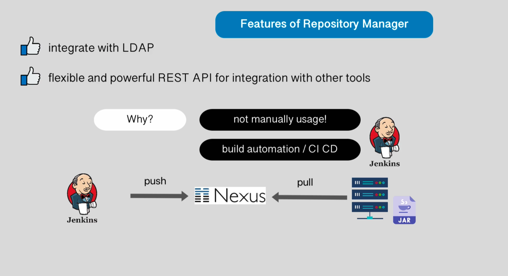

## Artifact Repository Manager - Nexus
- Artifact Repository ⇒ storage for artifacts
    - supports certain formats - jar, war, zip, tar
    - Artifact ⇒ apps built into a single file
        - can be in a different format - jar, war
    - Different app languages produce different artifact format types, so sometimes we will need different Artifact Repositories (MVNRepositories, NuGet, NPM) to store each of them - .jar, .dll
        - .NET ⇒ NuGet
        - Java ⇒ Maven
        - Js ⇒ NPM
        - Docker ⇒ Docker hub
        - Kubernetes ⇒ Helm
    - BUT Nexus stores all types of artifact formats
        - another competitor  - JFrog
        - Nexus allows to create Private Repository to store artifacts
            - and can act as a central Proxy repository to point to other public repositories as well, like Docker Hub, NuGet
            - normally not used locally like Docker Hub - to push or pull artifacts
            - Normally used with a CI/CD pipeline to pull artifacts to the Deployment Server, not a local pc
            - Nomally sits between the CI/CD pipeline
                
                
            - Helps in metadata tagging - tagging the artifact
            - Has cleanup policies - auto cleanup old artifacts
            - Search artifacts (despite the type format) across the repo manager
            - suport api token for system user authentication and integrations
- Artifact Types - Components vs Assets